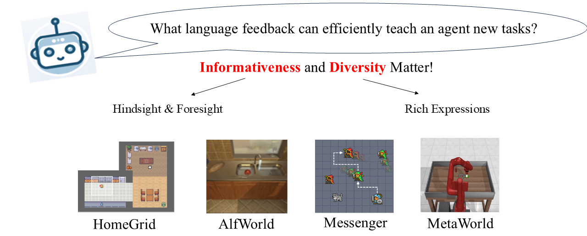

# :robot: Teaching Embodied Reinforcement Learning Agents: Informativeness and Diversity of Language Use
[]()



## :hammer_and_pick: Environment Setup

### HomeGrid
Create conda env.
```
conda create -n homegrid-ltdt python=3.8
conda activate homegrid-ltdt
```
Install packages.
```
cd <path/to/homegrid>
pip install homegrid
pip install -r requirements.txt --no-deps
```

### ALFWorld
Create conda env.
```
conda create -n alfworld-ltdt python=3.9
conda activate alfworld-ltdt
```
Install packages.
```
cd <path/to/alfworld>
pip install -e .[alfworld]
pip install -r requirements.txt --no-deps
```
### Messenger
Create conda env.
```
conda create -n messenger python=3.85
conda activate messenger
```
Install packages
```
git clone git@github.com:ahjwang/messenger-emma.git
cd <path/to/messenger/messenger-emma>
pip install -e . 
pip install git+https://github.com/ahjwang/py-vgdl
cd <path/to/messenger>
pip install -r requirements.txt --no-deps
```
Trouble Shoot: If you have difficulty installing packages from messenger-emma for pygame, comment the requirement for pygame version in messenger-emma/setup.py.

## :wrench: Model Training & Eval
For training and evaluation, please refer to the README in each folder.
- [HomeGrid](homegrid/README.md)
- [ALFWorld](alfworld/README.md)
- [Messenger](messenger/README.md)
- [MetaWorld](metaworld/README.md)

## 🤗 Data & Model ckpts
Data and model checkpoints are available here: [Data & Model Checkpoints](https://huggingface.co/datasets/sled-umich/Teachable_RL)

## Acknowledgement
This work was supported by NSF IIS-1949634 and has benefited from the Microsoft Accelerate Foundation Models Research (AFMR) grant program. We would like to thank the anonymous reviewers for their valuable comments and suggestions.

## Citation
